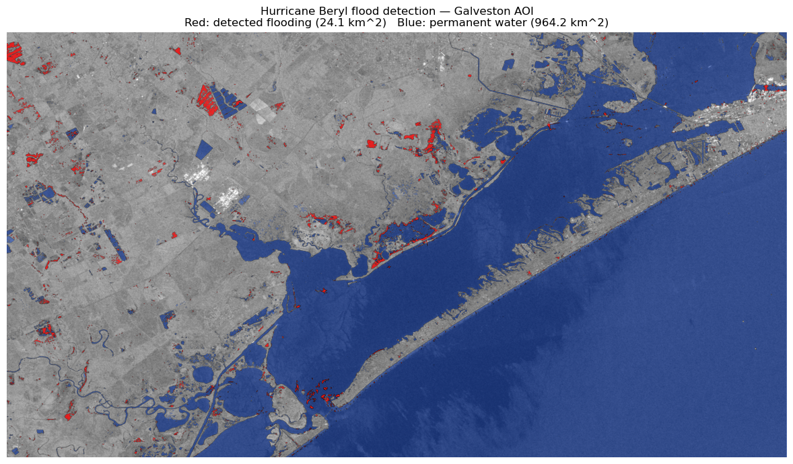

# SAR Flood Detection — Hurricane Beryl 2024

Sentinel-1 SAR-based flood mapping over Galveston Bay (Texas) 
following Hurricane Beryl landfall (8 July 2024). Independent 
analysis using free Copernicus data, with explicit comparison 
against the resolution and revisit limits versus commercial 
high-resolution SAR.

## Results

| Metric | Value |
|---|---|
| AOI | Galveston Bay, Texas (~2000 km²) |
| Detected new flooding | 24.1 km² |
| Permanent water (pre-event) | 964.2 km² |
| Method | Δ sigma0 < -3 dB on dual-date Sentinel-1 GRD |

Detection captures **rural and wetland flooding** at AOI scale 
but cannot resolve urban building-level inundation — a known 
trade-off versus commercial high-resolution X-band SAR.

## Pipeline
Sentinel-1 GRD (.SAFE)
│
├── SNAP preprocessing (flood_pipeline.xml)
│   Read → Apply-Orbit-File → Calibration → Speckle-Filter
│        → Terrain-Correction → Subset → LinearToFromdB → Write
│
├── Geocoded sigma0 VV in dB (EPSG:4326, 20 m)
│
└── Python change detection (notebooks/02_change_detection.ipynb)
Δ sigma0 → permanent water mask → threshold → cleanup → flood mask

Detailed operator-by-operator rationale: [`snap_graphs/README.md`](snap_graphs/README.md)

## Key project decisions

- **Sentinel-1 (free, C-band, 20 m, ~weekly revisit)** — chosen as the 
  realistic public-data baseline for any flood response application. 
  The whole point is to characterize what this data can and cannot do 
  before paying for commercial alternatives.
- **Two scenes only** — pre-event (29 June 2024) and post-event 
  (11 July 2024). Same orbit (track 143, descending), same acquisition 
  time of day, same swath: minimum geometric variability.
- **VV polarization only** — water has very low VV backscatter 
  (specular reflection); VH dropped for pipeline simplicity.
- **Classical change detection over deep learning** — the goal is 
  rigorous, defensible methodology. Threshold-based detection from 
  literature is reproducible; ML would add explanatory black boxes 
  without meaningful accuracy gain at this scale.
- **SNAP over Google Earth Engine** — SNAP is the operational standard 
  in SAR processing (ESA, defense, commercial SAR providers). Building 
  the pipeline in SNAP demonstrates familiarity with industry tooling.

## Repository structure
├── data/                       Documentation of source data and AOI, might be empty, due to a big tiffs
├── docs/                       Output figures (PNG)
├── notebooks/
│   ├── 01_diagnostics.ipynb    SNAP pipeline verification
│   └── 02_change_detection.ipynb   Flood mapping from preprocessed SAR
├── snap_graphs/
│   ├── flood_pipeline.xml      Working canonical SNAP graph
│   ├── README.md               Operator rationale
│   └── tests/                  Diagnostic test graphs (incremental verification)
├── environment.yml             Conda environment spec
└── README.md

## Reproducing this analysis

### Prerequisites
- SNAP 13 ([download from ESA STEP](https://step.esa.int/main/download/snap-download/))
- Python 3.12 with packages from `environment.yml`
- ~2 GB free disk for source SAR scenes

### Steps

1. **Download source data** — see [`data/README.md`](data/README.md) 
   for product IDs and Copernicus Data Space instructions.

2. **Run preprocessing** — open `snap_graphs/flood_pipeline.xml` in 
   SNAP Graph Builder, update file paths in Read/Write nodes, run 
   twice (once per scene). Or via SNAP CLI:
   3. **Run change detection** — open `notebooks/02_change_detection.ipynb`, 
   update `DATA_DIR` to point at SNAP outputs, Run All.

## Pipeline debugging story

The SNAP preprocessing pipeline initially failed silently — 
Terrain-Correction returned all-zero rasters with no error reported. 
Root cause analysis required incremental verification (the 
`tests/` test pipelines) and manual operator invocation, which 
ultimately revealed:

1. **Apply-Orbit-File is required by Terrain-Correction** (not optional)
2. **Subset before TC destroys SAR metadata** that TC needs — Subset 
   must be applied **after** TC (SNAP's lazy evaluation makes this 
   memory-efficient)
3. **GeoTIFF intermediates discard SAR metadata** — pipeline must 
   run end-to-end, intermediates cannot be saved-and-resumed

Full analysis in [`notebooks/01_diagnostics.ipynb`](notebooks/01_diagnostics.ipynb).

This kind of silent-failure debugging is endemic to SAR processing 
and a useful demonstration of methodical engineering practice.

## Limitations

See `notebooks/02_change_detection.ipynb` final section. In short:

- 20 m pixel cannot resolve individual buildings
- Single post-event snapshot misses peak flooding for fast-draining systems
- C-band penetrates vegetation poorly (flooded forests undetected)
- Urban double-bounce hides street flooding
- No depth estimation (extent only)

These are intentional design choices due to the Sentinel-1 data limitations

## License

MIT